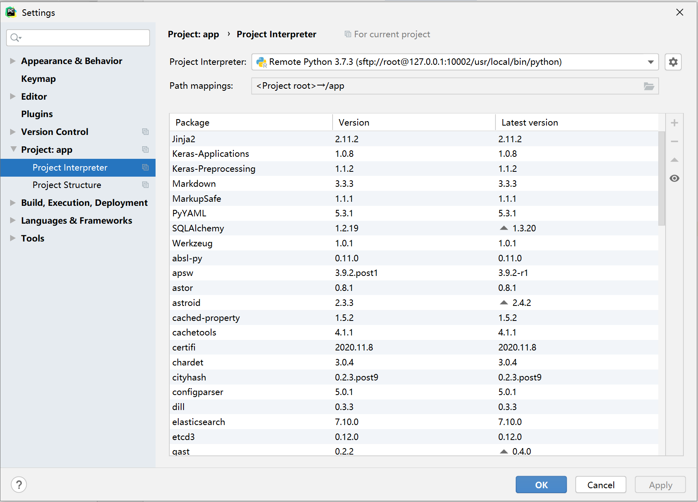

# Docker学习之SSH连接docker容器 - 柒's Blog

# 注：这篇文章为引用。为了防止哪天原文被删，特保留下来。原文地址为：[https://blog.52itstyle.vip/archives/2402/](https://blog.52itstyle.vip/archives/2402/)

# Docker学习之SSH连接docker容器

作者:小柒 发表于 2018-02-23    |   分类于[Docker](https://blog.52itstyle.vip/category/Docker/)

## 前言

不论是开发者是运维人员，都经常有需要进入容器的诉求，目前看，主要的方法不外乎以下几种：

使用ssh登陆进容器，需要在容器中安装启动sshd，存在开销和攻击面增大的问题，同时也违反了Docker所倡导 的一个容器一个进程的原则。容器本身是一个无状态，用后即焚的东西。为了尽量的轻量快捷建议一个容器尽量只有一个进程，否则你的容器会越来越大，越来越像一个虚拟机一样笨重不宜维护。

使用nsenter、nsinit等第三方工具，需要额外学习(暂不考虑)。

使用docker本身提供的工具，大多数情况最好还是使用Docker原生方法，Docker目前主要提供了Docker exec和 Docker attach两个命令。

## SSH连接

Docker基础知识回顾：[阿里云CentOS 7上安装配置Docker](https://blog.52itstyle.vip/archives/2217/)

查看镜像：

[root@iZ2ze74fkxrls31tr2ia2fZ ~]# docker images

REPOSITORY TAG IMAGE ID CREATED SIZE

centos-java latest feb3ca30b34b6weeks ago755.2MB

docker.io/centos centos3fa822599e1012weeks ago203.5MB

创建并运行容器：

docker run -tid --name app_learn -p5001:22-p5000:8080-v /home/app_learn/:/mnt/app/3fa822599e10/usr/sbin/init

进入容器:

dockerexec-it app_learn /bin/bash

安装依赖：

yuminstallpasswd openssl openssh-serveropenssh-clients -y

安装service命令：

yum install initscripts -y

修改密码：

[root@8c213535c149 mnt]# passwd

Changing passwordforuser root.

Newpassword:

Retypenewpassword:

passwd: all authentication tokens updated successfully.

修改配置：

vi/etc/ssh/sshd_config

PubkeyAuthenticationyes#启用公钥私钥配对认证方式

AuthorizedKeysFile .ssh/authorized_keys#公钥文件路径

PermitRootLoginyes#root能使用ssh登录

重启ssh服务，并设置开机启动：

servicesshd restart

chkconfig sshdon

远程连接：

通过物理机IP以及5001端口就可以远程连接Docker容器了。

[4.png](https://blog.52itstyle.vip/usr/uploads/2018/02/2498696327.png)

## 原生连接

docker ps

dockerattachapp_learn

ls

exit

执行以上命令可以看到attach可以进入到一个已经运行的容器，进行命令操作，但是从容器中退出之后容器也停止了，所以在生产环境中很少使用。

dockerexec

dockerexec-it app_learn /bin/bash

使用docker exec -it进入容器和我们平常操作console界面类似。而且不像attach方式退出，导致整个容器退出，生产环境中用的比较多。比使用ssh 、nsenter、nsinit方式更方便，生产中常用的方式。
