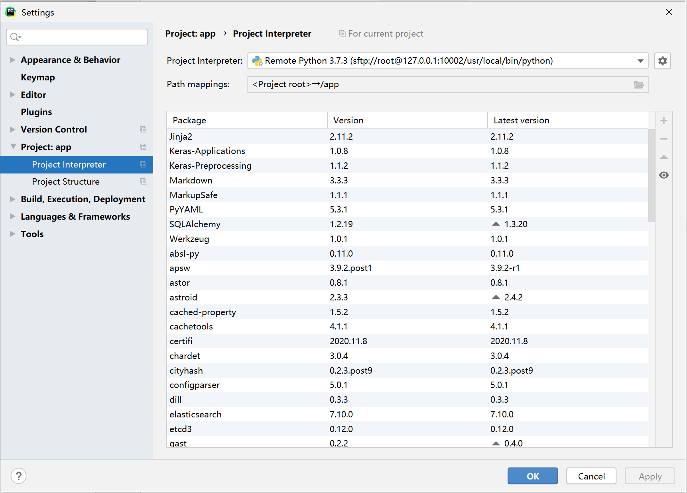

# 使用pycharm专业版远程调试docker容器的程序

1、资料援引与参考：

[https://zhuanlan.zhihu.com/p/115217861](https://zhuanlan.zhihu.com/p/115217861)

[https://my.oschina.net/kenblog/blog/1512272](https://my.oschina.net/kenblog/blog/1512272)

2、这个例子中的镜像是ubuntu的，我还找到了一篇centos镜像的

[https://blog.52itstyle.vip/archives/2402/](https://blog.52itstyle.vip/archives/2402/)

从GitHub上下载了字节跳动的一个叫做fedlearner的源码，该源码提供dockerfile文件，运行方式为使用dockerfile本地build出来镜像（image），然后run这个镜像，创建出容器（container），在容器中运行。

由于奇奇怪怪的原因，我甚至尝试过在Ubuntu下安装requirement.txt里面说的库，结果居然安装失败。所以只能build镜像，然后运行容器。

但是我下载代码是为了查看，学习，修改，可能随时需要print什么值或者断点调试。docker容器只有命令行界面显然无法满足需求，经过多次尝试，最终选择用pycharm远程调试docker里面的程序。过程记录如下：

已有的东西：

* Windows10系统，安装了docker for windows
* Windows版shadowsocks客户端，用于连接google，保证网络通畅
* Windows10系统安装了pycharm专业版
* 字节跳动的源码（内含dockerfile文件）

步骤：

    第一步、基于dockerfile构建镜像（image）

            以管理员权限运行cmd命令行，执行以下命令：

```
# 先切换到源码的根目录，保证该目录下有dockerfile文件
# 构建的镜像（image）文件名为fedlearner
# 注意这条命令最后有一个小数点，这个点不能少，代表在当前目录中寻找dockerfile文件进行镜像构建
C:\Users\Guangchen Song>docker build -t fedlearner .
```

    第2步、运行该镜像，直接起一个容器，然后把镜像里的应用的源码复制出来到宿主机。（这一步其实是有意义的。最开始的时候没有这一步，后面在运行该项目的python代码的时候提示缺少文件。其实是因为在使用dockerfile文件build镜像的过程中，使用make命令，基于makefile文件，生成了一些文件。这些文件可能是根据具体的cpu等不同，无法通用，所以源码作者通过dockerfile和makefile，让镜像在构建的过程中生成这些文件，而不是直接在源码中包含这些文件。那这么一来，我一开始直接运行源代码，显然是缺少这些文件的，所以运行不起来。）

```
# 直接起一个容器
C:\Users\Guangchen Song>docker run -it fedlearner bash
```

        然后再以管理员权限打开一个cmd窗口（原来的cmd窗口别管），执行以下程序，把容器中经过build后的应用程序源码复制到宿主机。本程序中，应用程序源代码在docker容器中的位置是 /app ，我们要把它复制到宿主机的 D:\Python\universal 目录下。

```
# 先看一下现在运行的容器的ID是什么，可以用 docker container list ，也可以用 docker ps -a ，后面这个命令可以看到所有容器，包括已经停止的容器。
C:\Users\Guangchen Song>docker container list
CONTAINER ID        IMAGE               COMMAND             CREATED             STATUS              PORTS                                           NAMES
d07037456249        fedlearner          "bash"              5 hours ago         Up 5 hours          0.0.0.0:9001->9001/tcp, 0.0.0.0:10002->22/tcp   fedlearnerCode

# 然后根据容器ID，指定把什么文件复制到哪里。（容器ID只要输入前4位就可以了）
C:\Users\Guangchen Song>docker cp d070:/app D:\Python\universal
```

        然后我们可以看到在宿主机的 D:\Python\universal 目录下多了一个app文件夹，里面就是docker容器的 /app 目录下的文件。

    第3步、关掉刚才打开的容器并删除，重新基于镜像fedlearner重新run一个容器，这次要加上文件夹映射（方便修改文件）和端口映射（方便ssh连接容器，后面使用pycharm远程调试）

```
# 关闭刚才打开的容器（要在一开始启动容器的那个cmd界面）
root@d07037456249:/app# exit

# 删除刚才的容器
C:\Users\Guangchen Song>docker rm d070

# 重新run一个容器，这次要加上文件夹映射和端口映射
#（这里有两个-p，即映射了两个端口。其实在这个例子中没必要，我们ssh只用“宿主机10002端口：docker容器的22端口”就可以了。之所以这么写，是为了示范以下映射多个端口的写法。
#   万一以后要用django等网络服务，本身就需要一个端口映射用来在宿主机的浏览器中查看运行结果，这时候就需要同时映射两个端口，一个用来在宿主机的浏览器中查看运行结果，另一个用来ssh连接）
C:\Users\Guangchen Song>docker run -it -v D:\Python\universal\app:/app -p 9001:9001 -p 10002:22 --name "fedlearnerCode" fedlearner bash
```

    第4步、在docker中安装必要的工具，进行必要的配置。

```
root@d07037456249:/app# apt-get install vim
root@d07037456249:/app# apt-get install ssh
# 启动ssh服务
root@d07037456249:/app# service ssh start
# 设置root密码
root@d07037456249:/app# passwd root
New password:
Retype new password:
passwd: password updated successfully
# 编辑ssh配置文件
root@d07037456249:/app# vim /etc/ssh/sshd_config
```

找到 /etc/ssh/sshd_config 这个文件中的一行（大约在第32行）：

#PermitRootLogin prohibit-password

把这一行前面的#符号删掉，prohibit-password改为yes，即把这一行改为：

PermitRootLogin  yes

然后保存并退出。然后重启ssh服务

```
# 重启ssh服务
root@d07037456249:/app# service ssh restart
```

    第5步：在宿主机的pycharm专业版中进行配置【在pycharm配置之前，建议先用putty绿色版ssh连接docker容器，确认一下ssh是否征程。ssh连接的地址是127.0.0.1:10002 （即宿主机的本地IP加上前面设置端口映射时，设置的本地机器端口号）】


        首先我们用 pycharm 打开宿主机本地代码文件夹（docker 配置的本地映射位置）（在本例中是用pycharm打开D:\Python\universal\app），然后我们进入 settings。

按照下图我们来新建一个 remote interpreter


        点击 Next 下一步，然后如下配置：


注意图中1号位置，Interpreter的设置。这里有个坑。docker中可能有好几个python文件，如果路径设置错了，可能会出现这样的问题：程序在docker容器里面，用命令 ”python 文件名“ 的方式能运行，但是在pycharm里面，会出现import报错，运行的话会报错说 ”No module named XXX“ 。解决方法：回到连接了docker容器的cmd窗口中，执行以下命令，查看默认调用的python是在什么位置，这个位置就是pycharm的project interpreter应该设置的位置：

```
# 查看默认的python是在什么位置，这里根据打印结果，我们看到默认的python解释器位置是在容器的 /usr/local/bin/python 
# 所以上图中1号位置应该填的值是 /usr/local/bin/python
root@d07037456249:/app# which python
/usr/local/bin/python
```

        配置好 interpreter以后，界面应该是这样（会把docker容器中安装的python模块显示出来，比如keras等）：



    第6步、点开具体要运行的源码的某个py文件，点右上角的“Edit Configuration”，配置好要执行的脚本（即py文件），即可远程运行/调试程序。


至此，pycharm远程调试/运行docker代码，配置完成

备注：经过这样一番配置以后，如果担心再开机以后docker容器就没了，还要重新配置很麻烦的话，有两个方法：

方法1：正常推出容器，下次用容器ID或容器名字重新start该容器，然后用exec命令开启容器的终端。

```
# 正常退出容器
root@d07037456249:/app# exit
```

等下次又想继续调试/修改这个容器的代码的时候：

```
# 查看容器ID
C:\Windows\system32>docker ps -a
CONTAINER ID        IMAGE               COMMAND             CREATED             STATUS                     PORTS               NAMES
d07037456249        fedlearner          "bash"              6 hours ago         Exited (0) 2 minutes ago                       fedlearnerCode
#  使用容器ID或容器名字重新开启容器（这里我使用容器名字 fedlearnerCode 开启容器）
C:\Windows\system32>docker start fedlearnerCode
#  使用exec命令连接开启的这个容器
C:\Windows\system32>docker exec -it fedlearnerCode bash
```
